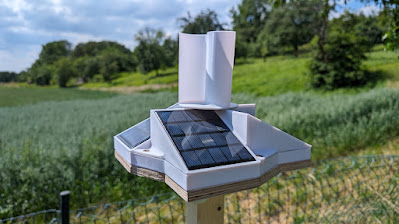
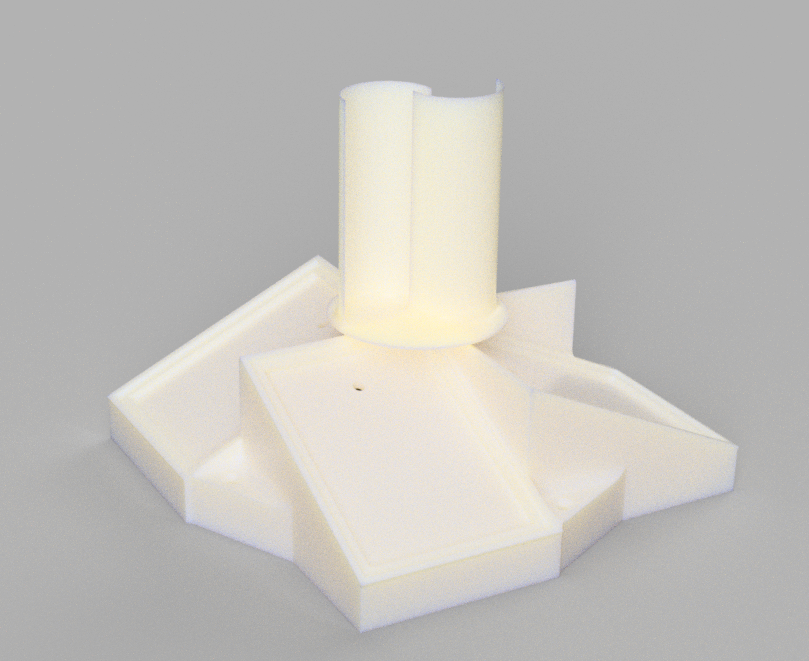

# ESP32 Weather Station

## Overview
This project involves building a weather station using the ESP32 microcontroller. The weather station is capable of measuring temperature, humidity, pressure, and various voltages (battery, solar, wind). The data is accessible through a simple HTTP server hosted on the ESP32, allowing for easy integration with other systems or monitoring platforms.

## Hardware Requirements
- **ESP32 Development Board**: Acts as the main controller and server host.
- **BME280 Sensor**: Used for measuring temperature, humidity, and atmospheric pressure.
- **ADS1115 Module**: An ADC (Analog-to-Digital Converter) used for reading voltages from various sensors.
- **Various Sensors**:
  - Battery voltage sensor
  - Solar panel voltage sensor
  - Wind sensor
- **SoftI2C**: Connections via specific GPIO pins for I2C communication.

### Connection Diagram
tbd

## Software Dependencies
- `uasyncio`: For asynchronous handling of server requests and general concurrency.
- `machine`: For interfacing with hardware pins and peripherals like the I2C interface.
- `BME280`: Library to interface with the BME280 sensor.
- `ads1x15`: Library to manage readings from the ADS1115 module.
- `network`: For connecting the ESP32 to a WiFi network.
- `json`: For creating JSON responses from sensor readings.

## Setup and Configuration
1. **Flash the ESP32**: Use your preferred method to flash the `boo.py` script onto the ESP32.
2. **WiFi Configuration**: Change the `ssid` and `password` in the script to match your WiFi network credentials.
3. **Sensor Calibration**: You may need to calibrate sensors, especially the ADC readings for accurate voltage measurements.

## Usage
Once the ESP32 is running, it will host a server accessible within your network:
- Access `http://<ESP32-IP>/battery` for battery voltage.
- Access `http://<ESP32-IP>/solar` for solar voltage.
- Access `http://<ESP32-IP>/wind` for wind sensor voltage.
- Access `http://<ESP32-IP>/temperature` for temperature readings.
- Access `http://<ESP32-IP>/humidity` for humidity readings.
- Access `http://<ESP32-IP>/pressure` for pressure readings.
- Access `http://<ESP32-IP>/all` for all sensor readings in JSON format.

## 3d model

The .stl files can be obtained from the [3dmodel folder](/3dmodel/).

## Robustness and Reliability Enhancements

To ensure the weather station operates reliably and can handle potential errors and system anomalies, several robust design practices and features have been implemented:

### Watchdog Timer
A Watchdog Timer (WDT) is set to reset the ESP32 if not reset within 5 seconds, preventing system deadlocks.

### Network Connectivity Checks
The system ensures connectivity to WiFi before operations, enhancing data reliability and access.

### Asynchronous Error Handling
Asynchronous operations are used with exception handling to prevent blocking and manage errors effectively, keeping the server responsive.

### Voltage Reading Retries
Critical voltage readings, like the battery voltage, are retried multiple times to avoid false readings due to sensor glitches or temporary issues.

### System Restart Mechanism
In case of critical failures, the system automatically attempts a restart, ensuring continuous operation despite errors.

These enhancements significantly improve the system's resilience to operational disruptions and data inaccuracies.

## Troubleshooting
If you encounter issues:
- Ensure all hardware connections are secure.
- Verify that the correct libraries are installed.
- Check the serial output from the ESP32 for error messages.
- Ensure that the WiFi network is within range and the credentials are correct.

Feel free to contribute or suggest improvements to this project!
