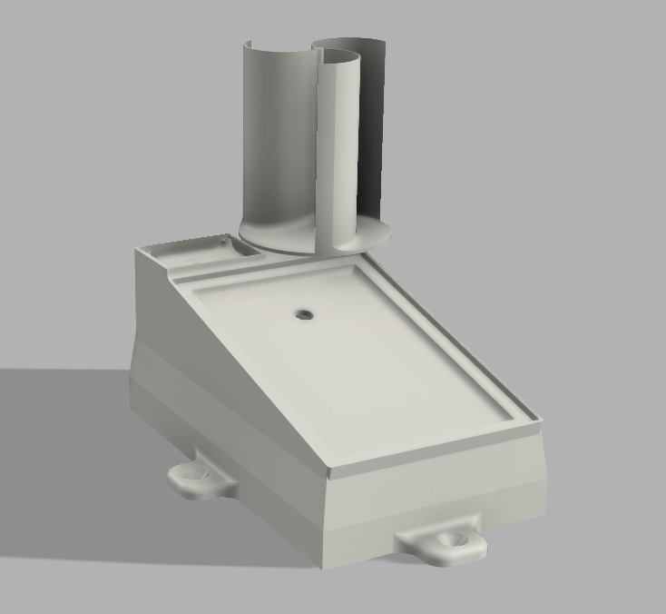
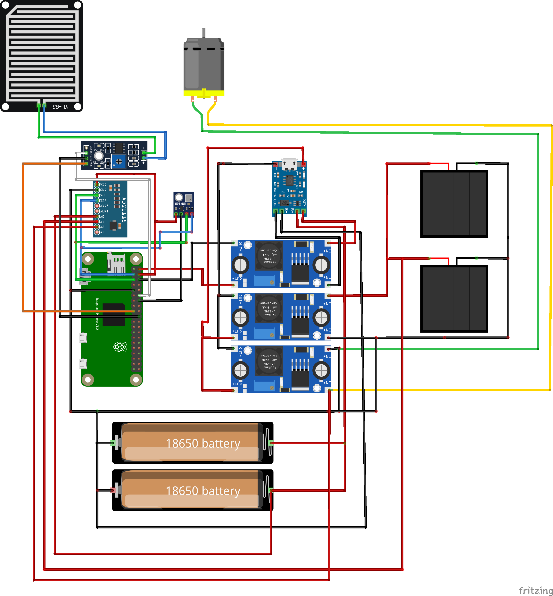

# DIY Weather Station

## Description
This project is a DIY weather station that monitors various environmental parameters using different sensors. It is powered by two 18650 lithium-ion batteries and utilizes solar and wind energy for recharging. The weather station collects data such as temperature, humidity, atmospheric pressure, wind speed, and solar intensity, which can be accessed remotely.

## Components Used

- **1 x Raspberry Pi Zero 2 W**
  - A compact and affordable single-board computer.
  - [Buy here](https://www.raspberrypi.com/products/raspberry-pi-zero-2-w/)
- **2 x 18650 Lithium-Ion Batteries**
  - Rechargeable batteries used for powering the system.
  - [Buy here](https://www.amazon.com/18650-rechargeable-battery/s?k=18650+rechargeable+battery)
- **2 x 5V Solar Module**
  - Solar panels used for harvesting solar energy.
  - [Buy here](https://www.amazon.com/5v-solar-panel/s?k=5v+solar+panel)
- **3 x Step Up DC Converter**
  - Boosts the voltage from the batteries to a stable level.
  - [Buy here](https://www.amazon.com/step-up-dc-converter/s?k=step+up+dc+converter)
- **1 x Raindrop Sensor**
  - Detects the presence and intensity of rainfall.
  - [Buy here](https://www.amazon.com/raindrop-sensor/s?k=raindrop+sensor)
- **1 x ADS1115**
  - Analog-to-Digital Converter for measuring voltage.
  - [Buy here](https://www.amazon.com/ads1115/s?k=ads1115)
- **1 x 18650 USB C Charging Module**
  - Module for charging 18650 batteries via USB C.
  - [Buy here](https://www.amazon.com/18650-usb-c-charging-module/s?k=18650+usb+c+charging+module)
- **1 x DC Motor (used as Windmill)**
  - Used to generate electricity from wind.
  - [Buy here](https://www.amazon.com/dc-motor/s?k=dc+motor)
- **1 x BMP280 (Temperature, Humidity, Pressure)**
  - Sensor for measuring temperature, humidity, and atmospheric pressure.
  - [Buy here](https://www.amazon.com/bmp280/s?k=bmp280)

## Wiring Diagram

### Wiring Connections

| Component          | Pin       | Connected To                  | Notes                                             |
|--------------------|-----------|-------------------------------|---------------------------------------------------|
| **Raspberry Pi Zero 2 W** | 5V        | Step-Up DC Converter Output  | Powering the Raspberry Pi                         |
|                    | GND       | Common Ground                 | Shared ground for all components                  |
|                    | GPIO 18   | Raindrop Sensor Signal        | Digital input from raindrop sensor                |
|                    | GPIO 2 (SDA) | BMP280 SDA                  | I2C data line for BMP280                          |
|                    | GPIO 3 (SCL) | BMP280 SCL                  | I2C clock line for BMP280                         |
|                    | GPIO 2 (SDA) | ADS1115 SDA                 | I2C data line for ADS1115                         |
|                    | GPIO 3 (SCL) | ADS1115 SCL                 | I2C clock line for ADS1115                        |

| **ADS1115**        | Pin       | Connected To                  | Notes                                             |
|--------------------|-----------|-------------------------------|---------------------------------------------------|
| VDD                | 5V Pin 4  | Raspberry Pi 5V Pin           | Powering the ADS1115                              |
| GND                | GND       | Any Ground Pin                | Ground connection                                  |
| SCL                | SCL       | GPIO 3 (SCL)                  | I2C clock line                                     |
| SDA                | SDA       | GPIO 2 (SDA)                  | I2C data line                                      |
| A0                 | Battery + | Battery Positive Terminal     | Measuring battery voltage                          |
| A1                 | Solar +   | Solar Panel Positive Terminal | Measuring solar panel voltage                      |
| A2                 | Wind +    | Wind Motor Positive Terminal  | Measuring wind motor voltage                       |

| **BMP280**         | Pin       | Connected To                  | Notes                                             |
|--------------------|-----------|-------------------------------|---------------------------------------------------|
| VIN                | 5V Pin 4  | Raspberry Pi 5V Pin           | Powering the BMP280                                |
| GND                | GND       | Any Ground Pin                | Ground connection                                  |
| SCL                | SCL       | GPIO 3 (SCL)                  | I2C clock line                                     |
| SDA                | SDA       | GPIO 2 (SDA)                  | I2C data line                                      |

| **Raindrop Sensor** | Pin      | Connected To                  | Notes                                             |
|---------------------|-----------|-------------------------------|---------------------------------------------------|
| VCC                | 3.3V/5V   | Raspberry Pi 3.3V/5V Pin      | Powering the raindrop sensor                       |
| GND                | GND       | Any Ground Pin                | Ground connection                                  |
| Signal             | GPIO 18   | Raspberry Pi GPIO 18          | Digital input signal                               |

## 3D Model

The 3d models are created using Fusion360 and can be downloaded [here](3dmodel/).

